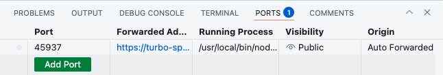

# CoW Tendermint

A multi-proposer tendermint implementation for the CoW Protocol auction.

## Setup

1. Run the devcontainer (or `npm ci && cp env.example .env` locally)
2. Either export an existing private key or generate a new random one with

```bash
export PK=$(hexdump -vn32 -e'"0x" 8/4 "%08x" 1 "\n"' /dev/urandom)
```

3. Make sure that the address with which you are signing is added to the validator/solver registry (cf. `.env` file for addresses). The address (public key) is printed each time you start the node.

## Running

There are two types of nodes, validators and solvers. Make sure your signing key is registered accordingly in the relevant registry (cf. above)

You can run either mode by specifying:

```bash
npx tsx index.ts <validator|solver>
```

If neither is specified, the client will run in both modes.

## Peer Discovery

The node will periodically print its peer count. Make sure you are connected to sufficient peers in order to ensure particpation in consensus.

### Discovering Peers

The node will automatically find peers on a local network. To connect to a remote peer you can pass their multiaddress in as a command-line argument like:

```bash
npx tsx index.ts /ip4/<IP>/tcp/<port>/wss/p2p/<peer_id>
```

To connect to a client running as a github devcontainer, you can use their container's DNS like:

```
npx tsx index.ts /dns4/<codespace_url>/tcp/443/wss/p2p/<peer_id>
```

### Getting Discovered

In order to be discovered by other nodes over the internet, make sure you are announcing your publicly visible IP address (not the IP address on your local network). You can specify your IP address using the `MULTIADDRESS` environment variable.

E.g. to make a devcontainer discoverable, you can add the following line to your env file:

```
MULTIADDRESS=/dns4/<container name>-<uid>-<port>.app.github.dev/tcp/443/wss
```

> [!NOTE]  
> Ensure, that the port's visibility is set to public.
> 

### Debugging

To configure custom log sensititvity, you can specify a log filter like:

```
LOG_FILTER=info,libp2p=trace,consensus=debug
```

To access lower level logs of the external libp2p library, also set

```
DEBUG=libp2p*
```
