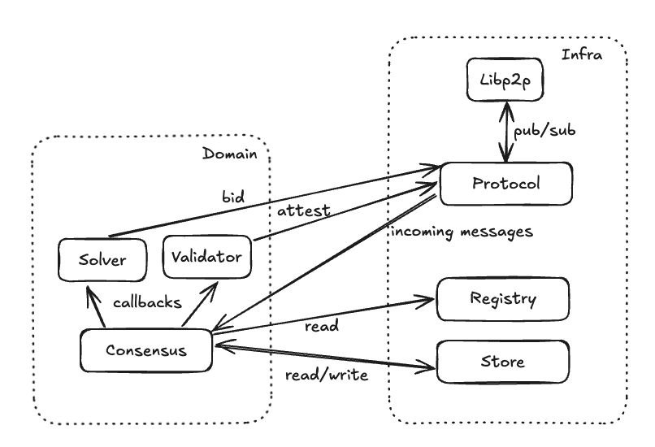
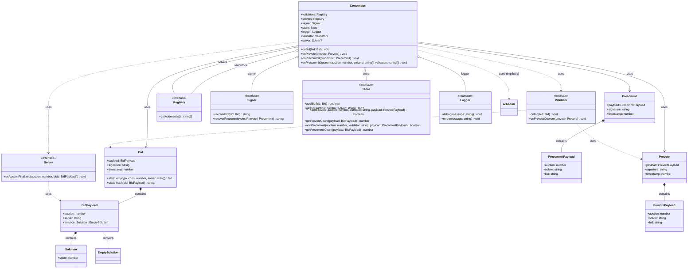
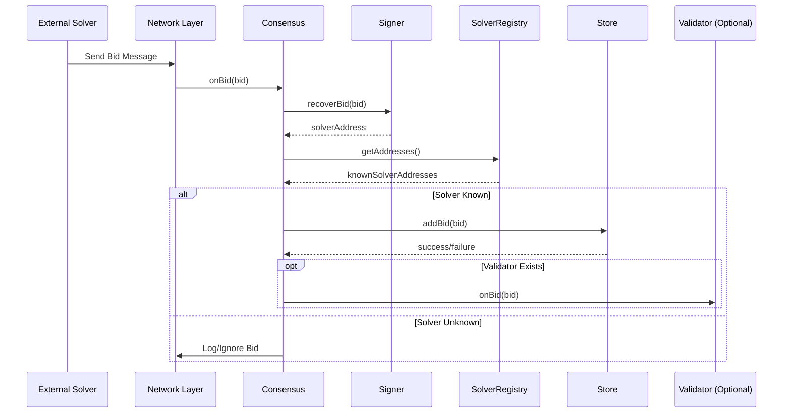

## Architecture

The source code is split into two main modules, `domain` and `infra`.

**Infra** contains abstractions for external dependencies (persistence, observability on-chain communication, third-party library signature wrappers, etc).

**Domain** contains domain specific logic such as the concrete tendermint consensus algorithm logic, the solver and validator behavior as well as domain specific data structures and runloop/shedulin logic.

- The core data models are defined in `./domain/model.ts`.
- Serialisation and translation to network level messages happens in `./infra/protocol.ts`

At the time of writing the overall architecture can be depictured as follows:

Cf. to module specific documentation in the code for more detailed information.

## Class Diagram

## Sequence Diagram

